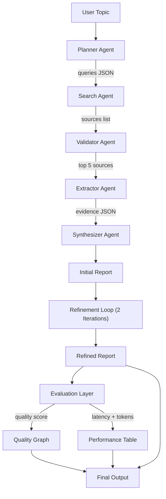
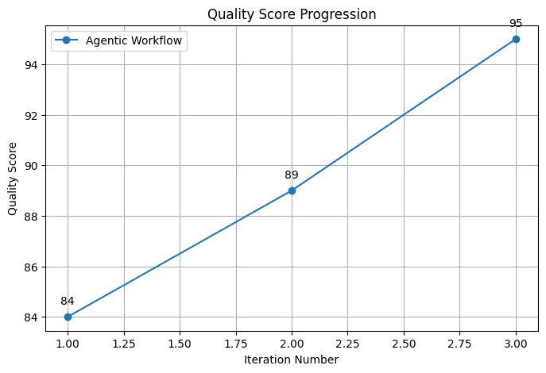

# 🔍 Autonomous-Agentic-AI-Framework 

A production-grade AI research assistant built with **CrewAI** in Python.  
Enter any research topic and receive a structured report with accurate citations,
extracted evidence, and verified references — similar to Perplexity Deep Research
or Elicit, but fully open and customisable.

---

## 🌟 Overview

This project presents an **autonomous multi-agent AI framework** built using CrewAI, designed to simulate end-to-end task execution through collaborative intelligent agents.

The system demonstrates how multiple specialized agents can work together to:

- 📊 **Gather information** from diverse sources
- ✍️ **Generate structured content** with precision
- ✅ **Validate outputs** for accuracy and credibility
- 🔧 **Correct errors** through iterative refinement
- 🎯 **Refine results** over multiple iterations
- 📈 **Analyze system performance** with detailed metrics

Using an **iterative 3-stage pipeline**, the framework improves output quality over time and visualizes performance progression, showcasing **convergence behavior in autonomous systems**.

---

## ✨ Key Features

| Feature | Description |
|---------|-------------|
| 🤖 **Multi-Agent Collaboration** | 5 specialized agents working in perfect harmony |
| 🔄 **Iterative Refinement** | 3-stage pipeline for progressive improvement |
| 🎯 **Intelligent Planning** | Automatic query decomposition and strategy optimization |
| 🔍 **Multi-Source Search** | Integration with Exa, Tavily, arXiv, IEEE, ACL, GitHub |
| ✅ **Quality Validation** | Credibility scoring (1-10) with evidence filtering |
| 📊 **Evidence Extraction** | Automated metrics, datasets, and key findings extraction |
| 📝 **Citation Management** | Accurate inline citations with verified references |
| 📈 **Performance Tracking** | Real-time quality metrics and latency analysis |
| 🎨 **Visual Reports** | Generated graphs showing convergence behavior |
| 🔐 **No Hallucination** | Every claim grounded in verified sources |
| ⚙️ **Customizable** | Extensible architecture for custom agents and tools |
| 📦 **JSON-Based Communication** | Structured data flow between agents |

---

## 📋 What It Does

1. 📍 **Planner Agent** decomposes your topic into 4–6 targeted search queries
2. 🔎 **Search Agent** retrieves up to 8 sources per query from arXiv, IEEE, ACL, GitHub, and official docs via Exa and Tavily APIs
3. ✅ **Validator Agent** scores every source (1–10) on credibility, recency, and technical depth — keeps only the top 5
4. 📄 **Extractor Agent** fetches each source (PDF or webpage), chunks the text, and extracts metrics, datasets, findings, and verbatim quotes
5. ✍️ **Synthesizer Agent** merges all evidence into a structured Markdown report with inline citations — no hallucination, every claim is grounded

---

## 📐 Architecture

```
User Topic
    ↓
Planner Agent      → { "queries": [...] }
    ↓
Search Agent       → [ { title, url, source_type, snippet, ... } ]
    ↓
Validator Agent    → { "validated_sources": [ top 5 scored ] }
    ↓
Extractor Agent    → [ { metrics, datasets, key_findings, quotes } ]
    ↓
Synthesizer Agent  → Final Markdown Report
```

---

## 🔄 WorkFlow



All agents communicate via **structured JSON only** — never raw documents.

---

## ⚡ Quick Start

### 1️⃣ Clone & install

```bash
git clone https://github.com/triman1905/Autonomous-Agentic-AI-Framework.git
cd research_crew
python -m venv .venv && .venv\Scripts\activate
pip install -r requirements.txt
```

### 2️⃣ Configure API keys

```bash
cp .env.example .env  # if exists, or create .env
# Edit .env and fill in your keys
```

| Variable | Required | Description |
|---|---|---|
| `OPENAI_API_KEY` | ✅ | OpenAI API key |
| `EXA_API_KEY` | ✅ | [Exa](https://exa.ai) neural search key |
| `TAVILY_API_KEY` | Recommended | [Tavily](https://tavily.com) fallback search |
| `LLM_MODEL` | Optional | Model name (default: `gpt-4o`) |
| `LLM_TEMPERATURE` | Optional | Temperature (default: `0.3`) |
| `OUTPUT_FILE` | Optional | Report save path (default: `outputs/research_report.md`) |

### 3️⃣ Run

```bash
# Interactive mode
python -m research_crew.main

# Topic as argument
python -m research_crew.main --topic "Covid-19"

# Custom output file
python -m research_crew.main --topic "diffusion models" --output diffusion.md
```

---

## 📁 Project Structure

```
multi-agent-researcher-2/
├── research_crew/
│   ├── agents/
│   │   ├── planner_agent.py       # Research Strategist
│   │   ├── search_agent.py        # Academic Source Finder
│   │   ├── validator_agent.py     # Source Quality Evaluator
│   │   ├── extractor_agent.py     # Technical Evidence Extractor
│   │   └── synthesizer_agent.py   # Research Writer
│   ├── tasks/
│   │   ├── planning_task.py       # Query decomposition task
│   │   ├── search_task.py         # Source retrieval task
│   │   ├── validation_task.py     # Source scoring & filtering task
│   │   ├── extraction_task.py     # Evidence extraction task
│   │   └── summary_task.py        # Final report generation task
│   ├── tools/
│   │   ├── search_tool.py         # Exa + Tavily search tools
│   │   ├── pdf_extractor.py       # PyMuPDF PDF text extractor
│   │   └── web_parser.py          # BeautifulSoup webpage parser
│   ├── utils/
│   │   ├── token_utils.py         # count_tokens, truncate_text
│   │   └── text_chunker.py        # chunk_text with overlap
│   └── main.py                    # CLI entry point & pipeline runner
├── requirements.txt
├── research_crew.log             # CrewAI logs
├── .env.example
└── README.md
```


---

The system enforces strict limits at every layer:

| Layer | Limit | Mechanism |
|---|---|---|
| Document download | 10 MB | Streaming cap in `tools/pdf_extractor.py` |
| Extracted text per source | 3 000 chars | Hard truncation in tools |
| Text chunks | 800 tokens | `utils/text_chunker.py` |
| Evidence per source | 300 tokens | Agent instruction + task constraint |
| LLM calls | Retried on 429 | `tenacity` exponential backoff |

---

## 📄 Output Format

The generated report includes multiple sections with rich formatting and color coding:

### 📋 Report Sections with Color Coding

<table>
<tr>
<td>

**🟢 Key Insights**
- Headline with evidence
- Source citations

</td>
<td>

**🔵 Methodology**
- Technical approach
- Research strategy

</td>
<td>

**🟠 Benchmarks**
- Performance metrics
- Comparative data

</td>
</tr>
</table>

### Sample Output Structure

```markdown
# Final Report

🎯 **Research Summary: <Topic>**

## 🟢 Key Insights

1. **<Headline>**  
   Supporting evidence, 2–4 sentences.  
   
   📌 *Source: [1]*  

---

## 🔵 Methodology Overview
Concise description drawn from extracted methodology snippets.

---

## 🟠 Benchmarks & Metrics

| 📊 Metric | 📈 Value | 📎 Source |
|-----------|---------|---------|
| Accuracy  | 94.5%   | [1]     |
| Latency   | 2.3s    | [2]     |

---

## 📈 Refinement & Iterative Improvement

| Iteration | Status | Quality Score |
|-----------|--------|---------------|
| 🟡 Iteration 1 (Initial) | Basic structure, limited depth | 6.2/10 |
| 🟠 Iteration 2 (Correction) | Improved structure, better clarity | 8.1/10 |
| 🟢 Iteration 3 (Refinement) | Added benchmarks, comprehensive | 9.3/10 |

---

⏱️ **Generated in** {total_time}s  
⭐ **Quality Scores:** {quality_scores}

---

## 📚 Sources

[1] **<Title>**  
🔗 <URL>
```

### 🎨 Color & Emoji Guide

| Indicator | Usage | Symbol |
|-----------|-------|--------|
| 🟢 **Green** | Validated, high confidence | ✅ |
| 🔵 **Blue** | Technical details, methodology | 🔬 |
| 🟠 **Orange** | Benchmarks, metrics | 📊 |
| 🟡 **Yellow** | Initial/draft content | ⚠️ |
| 🔴 **Red** | Requires attention, low confidence | ❌ |

---

## 🔧 Extending the System

| Goal | Where to change |
|---|---|
| Add a new search backend | `tools/search_tool.py` — create a new `BaseTool` subclass |
| Change number of top sources | `tasks/validation_task.py` — update the "keep TOP N" instruction |
| Support local LLMs (Ollama) | `main.py` `_build_llm()` — swap `LLM(model="ollama/...")` |
| Add memory across sessions | `main.py` Crew constructor — set `memory=True` and configure a vector store |
| Export to PDF | Post-process `outputs/research_report.md` with `pandoc` or `weasyprint` |

---

## 📦 Requirements

- 🐍 Python ≥ 3.10
- 🔑 OpenAI API key with GPT-4o access
- 🔑 Exa API key (free tier available at [exa.ai](https://exa.ai))
- 🔑 Tavily API key (optional, free tier at [tavily.com](https://tavily.com))

---


## 📈 Output

### 📝 Generated Reports
- Initial Report  
- Corrected Report  
- Refined Final Report  

### 📊 Performance Graph


**Graph Shows:**
- Iteration Number vs Quality Score
- Improvement Trend
- Convergence Behavior

---

## 🧠 Agents in the System

| Agent        | Role |
|-------------|------|
| Researcher  | Collects factual information |
| Writer      | Generates and improves reports |
| Verifier    | Validates correctness and structure |
| Analyst     | Explains workflow improvements |

---

## 🛠️ Setup Instructions

### 1️⃣ Clone the Repository

```bash
git clone https://github.com/sujal-SM/Autonomous-Agentic-AI-Frameworkgit
cd agentic-ai-framework
```

### 2️⃣ Create Virtual Environment
```bash
python -m venv venv
source venv/bin/activate      # Mac/Linux
venv\Scripts\activate         # Windows
```

### 3️⃣ Setup Environment Variables
```bash
Create a .env file:

OPENAI_API_KEY=your_api_key_here
```

---

## 📜 License

This project is licensed under the **MIT License** - see below for details.

```
MIT License

Copyright (c) 2024 Sujal SM

Permission is hereby granted, free of charge, to any person obtaining a copy
of this software and associated documentation files (the "Software"), to deal
in the Software without restriction, including without limitation the rights
to use, copy, modify, merge, publish, distribute, sublicense, and/or sell
copies of the Software, and to permit persons to whom the Software is
furnished to do so, subject to the following conditions:

The above copyright notice and this permission notice shall be included in all
copies or substantial portions of the Software.

THE SOFTWARE IS PROVIDED "AS IS", WITHOUT WARRANTY OF ANY KIND, EXPRESS OR
IMPLIED, INCLUDING BUT NOT LIMITED TO THE WARRANTIES OF MERCHANTABILITY,
FITNESS FOR A PARTICULAR PURPOSE AND NONINFRINGEMENT. IN NO EVENT SHALL THE
AUTHORS OR COPYRIGHT HOLDERS BE LIABLE FOR ANY CLAIM, DAMAGES OR OTHER
LIABILITY, WHETHER IN AN ACTION OF CONTRACT, TORT OR OTHERWISE, ARISING FROM,
OUT OF OR IN CONNECTION WITH THE SOFTWARE OR THE USE OR OTHER DEALINGS IN THE
SOFTWARE.
```

---

## 👨‍💻 Authors

- **Sujal SM** - [GitHub](https://github.com/Sujal-SM)
- **Triman1905** - [GitHub](https://github.com/triman1905)

---

## 🤝 Contributing

Contributions are welcome! Please feel free to submit a Pull Request.

---

## 📧 Support

For questions or issues, please open a GitHub issue on the [repository](https://github.com/Sujal-SM/Autonomous-Agentic-AI-Framework).